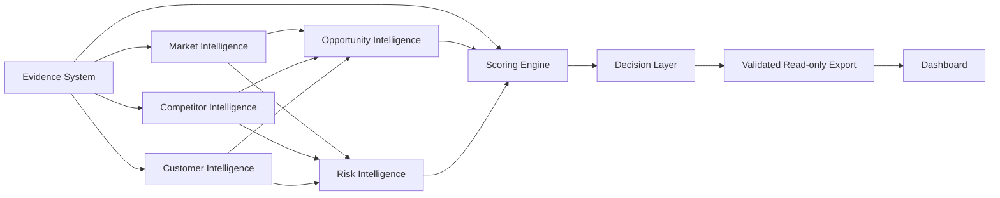
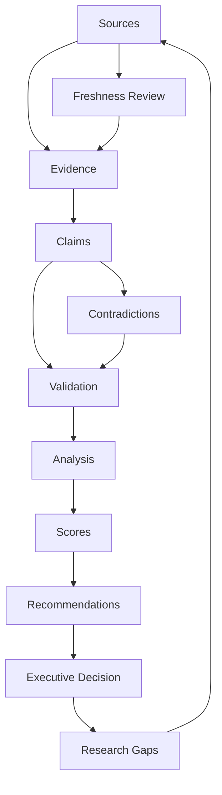

# Product architecture

Market Intelligence Vault 1.1.0 retains the hardened 1.0.1 scoring engine. Numbered directories
remain the canonical analytical workspace; public documentation does not create duplicate data.
The application uses Python's standard library and browser-native ES modules. There is no hosted
backend, ingestion endpoint, account system or production database.

## Canonical inputs and derived outputs

`config/data_contract.json` defines contracted CSV topology and fields. Six schemas validate source,
evidence, competitor, segment, opportunity and risk objects. Claims/maps/decisions have CSV contracts.
Model CSVs own weights, orientation and anchors; scoring_policy.json owns caps and support adjustment;
freshness.json owns age windows. A per-factor assessment records the basis, references and reviewer.
Sources include archived locators/hash and rights context; source and evidence metadata must agree.

The scorer derives observation strength/grade/freshness, conservative claim confidence, business
indices, comparison scores and CSV dashboard views. Stored derived values must reconcile at an explicit
as-of date. An interrupted score transaction blocks delivery until recovery. Exported viewing CSVs
are sanitized copies and must not be fed back as canonical analytical inputs.

## Evidence relationships

Stable source, evidence, claim and map IDs form the trace. Map relationship is support, contradiction
or context; only eligible independent support contributes corroboration. The current evidence item
binds a single claim. Critical support determines the weakest material dependency. An unresolved
contradiction caps claim confidence and remains visible; it does not erase valid source observations.
See [contract guide](docs/architecture/DATA_CONTRACTS.md).

## Validation and scoring layer

`common.py` owns confinement, CSV primitives, URL policy and input digest. `schema_validation.py`
implements the closed supported schema subset. `validate_repository.py` checks shape, references,
dates, archived bytes, semantic consistency, factor coverage, Markdown links and optional score audit.
`calculate_scores.py` owns calculation/recovery. `check_sources.py` is an offline review audit, not
a reachability or truth checker. Use fixed-date sample tests separately from reviewed live validation.

## Dashboard export and browser

`export_dashboard_data.py` validates and reconciles before explicit field projection. Twelve JSON
files contain shared `{meta,data}`; snapshot.json covers their hashes. Single IDs remain strings,
plural references arrays and absent optional scalar values null. No archive paths/raw bytes are
included. The launcher validates/refreshes and serves only fixed asset/data routes on 127.0.0.1.
Full-repository data requests refuse changed inputs/archives. The browser checks hashes/common
metadata before rendering and fails without invented fallback data. Native modules separate loading,
formatting, filtering, tables, evidence details, ordinal charts and 14 routes.

## Approval and packaging

`build_delivery_package.py` retains an explicit foundation/live file allowlist, viewer sanitization,
input-bound sign-off, critical-risk acceptance and irreversible-action checks. `verify_package.py`
checks inventory and checksums. A TEST requires an explicit positive cap; a recorded recommendation
status is not spending authority. Dashboard approval invokes the same existing rules and cannot
promote fictional or historical records to current live approval. Source releases, client reading
packages and standalone dashboard snapshots have different scopes and must be reviewed separately.

## Security boundaries

Paths are confined; links/junctions and traversal are refused. Credential URLs are rejected, citations
are not fetched, text is escaped and the server supplies a restrictive CSP, no-store and nosniff.
No listing exposes the repository. Hashes authenticate no publisher or signer. Local operators remain
trusted; external authentication, encryption, cloud access and monitoring are absent. Read
[security controls](SECURITY_AND_PRIVACY.md) before handling real research.

## Public repository layer

README/whitepaper/governance describe capabilities without changing them. Documentation indexes
link canonical files. CI runs existing suites, validation, export and public hygiene checks with
read-only permissions and pinned Actions. CI is authored but has not executed on GitHub while publication
is deferred. Future lifecycle changes need explicit schema/model migration and threat review.
