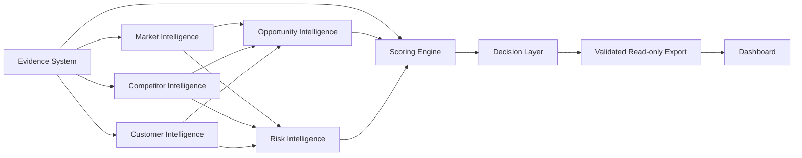
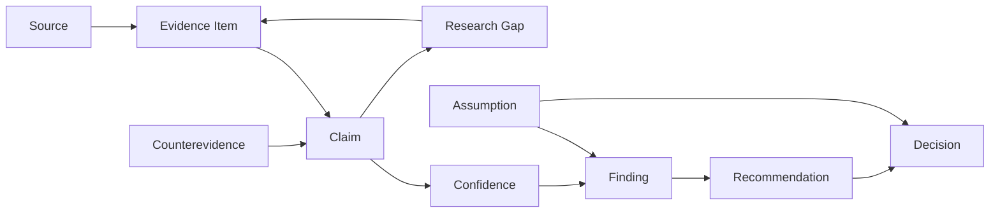
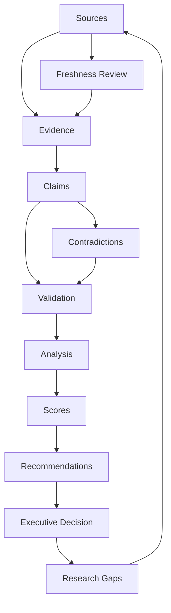
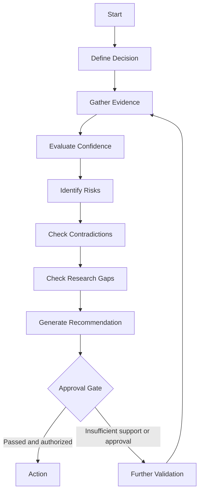
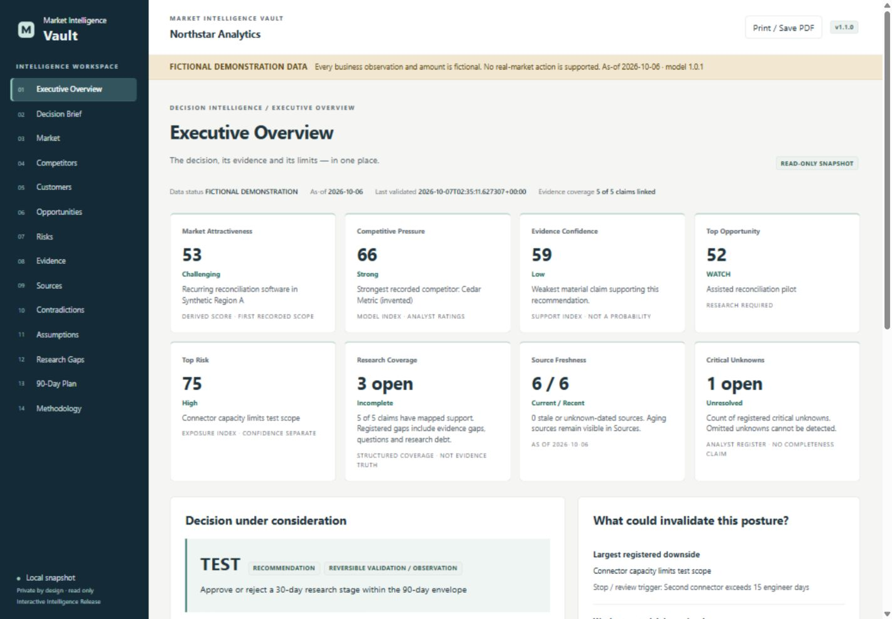

# Market Intelligence Vault

**Evidence-Based Market, Competitor, Customer, Risk & Opportunity Intelligence**

A local research and decision-support product that connects source observations to claims, explicit
uncertainty, heuristic indices and reviewable recommendations. Built for analysts who need a traceable
research workspace and executives who need to see the decision, its weakest support and its downside.

  

## Status and release

**Product 1.1.0 — Interactive Intelligence Release; scoring model 1.0.1.** Implementation verification:
97 automated tests passed in the local release baseline. See [release verification](RELEASE_VERIFICATION_1.1.0.md)
and [public preparation verification](docs/releases/PUBLICATION_VERIFICATION.md) for executed results and scope.
GitHub publication is currently deferred; no remote CI pass, published tag or GitHub Release is claimed.
This project is publicly inspectable with rights reserved, not open-source licensed.

## Important trust boundary

The framework **does not automatically authenticate source truth**. Confidence and decision indices
are **not statistical probabilities**. A URL is a citation; a file hash establishes local integrity,
not publisher authenticity. Passing validation is not a guarantee of semantic validity or business outcomes.
The included Northstar Analytics study is **FICTIONAL DEMONSTRATION DATA** and authorizes no real-market action.

## Core capabilities

- Contracted CSV registers, six object schemas and semantic validation.
- Source, evidence and claim lineage with support, contradiction and context relationships.
- Conservative confidence caps, configurable freshness and per-factor rating provenance.
- Market attractiveness, competitor pressure, opportunity merit/support and ordinal risk exposure.
- Decision briefs, critical-uncertainty review, bound live sign-off and 90-day action tracking.
- Fourteen-section local dashboard, sortable/filterable tables, drilldowns, sensitivity and print views.
- Allowlisted reading packages, archive checks and regression tests for malformed or unsafe inputs.

## Why this project exists

Research often ends as a persuasive report whose underlying observations, missing variables and
decision assumptions are difficult to inspect. This repository makes those dependencies explicit.
It helps a reviewer ask what supports a proposal, what challenges it, what is still unknown and what
must be checked before an irreversible commitment. It does not substitute a ranking for authority.

## Why it is different

Evidence quality, business merit and approval are separate. Strong source observations cannot
silently promote a disputed claim; a high opportunity index cannot authorize spending. Weak threat
confidence cannot discount exposure. Missing values stay distinguishable from legitimate zeros.
The executive view retains material weaknesses while the analyst can inspect the same underlying IDs.

## Architecture

Canonical Python/CSV controls own analysis; native browser modules present validated snapshots.
There is no frontend build, cloud account, remote font, CDN or external data fetch at runtime.
See [ARCHITECTURE.md](ARCHITECTURE.md) and [dashboard architecture](DASHBOARD_ARCHITECTURE.md).



## Evidence architecture

Sources retain citation metadata and archived locators. Observations carry scoped summaries, status,
directness and derived strength. Claims are interpretations with separate confidence and materiality.
Counterevidence and assumptions stay attached to the analytical trail. Current evidence records bind
one claim; observation-to-many-claim lifecycle support remains planned.



See [data contracts](docs/architecture/DATA_CONTRACTS.md), [dictionary](DATA_DICTIONARY.md)
and [source evaluation](SOURCE_EVALUATION.md).

## Decision intelligence workflow

Define the decision and scope before collection. Capture observations, challenge interpretations,
review fresh support, document rating bases, recompute and validate. The owner reviews the proposal
and its commitment gate separately. Feedback loops are manual research responsibilities, not an
implemented monitoring service.





## Confidence framework

Observation strength combines reliability, freshness, directness, independent corroboration and
relevance. Claim confidence follows the weakest material supporting observation with explicit
statement-type and contradiction caps. Hypotheses and unresolved conflicts cap at 59 Low.
Read [CONFIDENCE_SCORING.md](CONFIDENCE_SCORING.md); independence and meaning require human review.

## Opportunity framework

Nine ordinal business factors define merit; evidence support adjusts it once:
`adjusted = merit × (0.25 + 0.75 × support / 100)`. Categories use unrounded arithmetic.
Dashboard details expose factor assumptions and bounded single-factor ±1 sensitivity. Rankings do
not create authority. Read [OPPORTUNITY_SCORING.md](OPPORTUNITY_SCORING.md).

## Risk framework

Likelihood, impact, detection difficulty, velocity and inverse mitigation readiness form an ordinal
exposure index. Catastrophic combinations and documented upward overrides force Critical.
Zero exposure has an explicit structural-assumption review; missing is not zero. Confidence is
reported separately. Read [RISK_SCORING.md](RISK_SCORING.md).

## Competitor intelligence

Compare rivals within relevant tasks, segments, currencies and pricing periods. Pressure factors
expose incumbent capabilities and switching burdens. The overview uses the strongest recorded rival,
not a fabricated market average. [Methodology](METHODOLOGY.md) and [scoring navigation](docs/scoring/README.md)
explain the historical descriptors and the dashboard's separately disclosed presentation bands.

## Customer intelligence

Segments connect jobs, pains, purchase triggers, objections and criteria to claim/evidence IDs.
Customer observations show support counts, source quality, sample size and population/bias limits.
Convenience interviews do not establish prevalence or willingness to pay. Retain exclusion criteria
and distinguish a reported pain from an observed purchase.

## Research gaps

Evidence gaps, research questions, research debt and critical unknowns stay registered with ownership
and relevant dependencies. Overview counts summarize recorded entries, not research completeness.
Use [research standards](RESEARCH_STANDARDS.md) to define the next observation that could change a decision.

## Contradiction monitoring

The contradiction view exposes both sides of unresolved disputes and the required follow-up.
Claim confidence is constrained while disagreement remains unresolved. Filters can focus on conflict
without removing records from the snapshot. This is a review interface, not automatic conflict resolution.

## Interactive dashboard

Executive Overview, Decision Brief, Market, Competitors, Customers, Opportunities, Risks, Evidence,
Sources, Contradictions, Assumptions, Research Gaps, 90-Day Plan and Methodology. Eight cards give
scoped whole-point indices and uncertainty counts. Exact arithmetic, source limits and approval
status remain available in details. See the [dashboard guide](dashboard/README.md).

## Screenshots

The following is an actual locally rendered fictional demonstration, not a real company study.



Additional verified views are indexed in [assets](assets/README.md). **HERO IMAGE FILE REQUIRED**:
no verified project hero image was available; its reference is deliberately omitted.

## Repository structure

| Area | Canonical purpose |
|---|---|
| 01_executive–04_customers | Executive reports, market, competitor and customer research |
| 05_opportunities–07_strategy | Opportunity, risk, uncertainty, recommendations and action planning |
| 08_evidence | Source, evidence, claim, relationship and research-gap registers |
| 09_scores | Versioned model weights/anchors and per-factor bases |
| 10_dashboards | Derived CSV views and specification |
| 11_delivery | Reviewed report/readout/package guidance |
| 12_examples | Fictional Northstar artifacts and six synthetic source archives |
| dashboard | HTML/CSS/browser modules, local launcher, exports and tests |
| tools / schemas / config / tests | Scoring, validation, contracts, policies and regressions |
| docs / assets / .github | Reader navigation, documentation visuals and collaboration/CI configuration |

## Quick start

Python 3.12 is the verified development runtime. From the full repository:

```text
python tools/validate_repository.py --as-of 2026-10-06 --audit-scores
python dashboard/launch_dashboard.py
```

Open `http://127.0.0.1:8765/`. If that port times out on your workstation, launch with `--port 8766`.
Ctrl+C stops the server. Do not open index.html directly. No application dependencies or internet are
required. Node.js is needed only for the developer UI tests. See [QUICK_START.md](QUICK_START.md).

## Example workflow

Read the decision brief, identify its material claims, inspect supporting and contradicting observations,
review source quality/freshness, then compare risks and uncertain factors. Record what validation would
change the posture. For a new private engagement, use `tools/initialize_engagement.py --output engagement_new`
and move it into a restricted non-public workspace before research. Configure its dashboard metadata
explicitly and refresh before reading it; never use a copied fictional snapshot as engagement evidence.

## Synthetic demonstration

Northstar Analytics is invented. CLM-001 remains disputed with confidence 59 Low; EV-006 is retained
as counterevidence. OPP-001 has merit 75.789… and adjusts to 52.48 WATCH, RESEARCH REQUIRED.
The proposed TEST is ACTION NOT APPROVED. Start at [Northstar navigation](docs/examples/README.md).

## Security and privacy

The server binds loopback and exposes a fixed allowlist. Export validates contracts, scores, paths,
known demo markers and credential URLs. Archive hashes detect changed bytes. CSV viewing copies
neutralize formula-leading text; canonical research stays in the controlled workspace. Human review,
rights, encryption, access control and private-data handling remain operator responsibilities.
See [disclosure policy](SECURITY.md) and [security/privacy controls](SECURITY_AND_PRIVACY.md).

## Testing

```text
python -m unittest discover -s tests -v
python -m unittest discover -s dashboard/tests -v
node --test dashboard/tests/test_ui.mjs
python tools/check_public_repository.py
```

The implementation baseline has 68 repository, 18 dashboard-export and 11 UI tests. Public checks
verify file/link/image references, version/citation metadata, diagrams and conservative secret patterns.
Local results and remote CI are distinct; a workflow configuration is not a successful GitHub run.

## Current limitations

No automatic ingestion, authenticated service, source/signer authentication, real-time updates,
empirical calibration or guaranteed business outcomes. The schema validator supports its shipped
closed subset. Single-factor sensitivity is not a joint stress test or statistical interval.
Registered counts do not establish completeness. Read [DISCLAIMER.md](DISCLAIMER.md).

## Roadmap

[ROADMAP.md](ROADMAP.md) labels 1.1.x refinement, 1.2.0 Research Lifecycle and 2.0.0 Operated
Intelligence proposals **PLANNED — NOT CURRENTLY IMPLEMENTED**. Current dashboard sensitivity
must not be confused with planned joint scenarios or longitudinal calibration research.

## Whitepaper

[Market Intelligence Vault: An Evidence-Based Framework for Traceable Market and Decision Intelligence](WHITEPAPER.md)
explains the design, arithmetic, human review boundaries and future research questions.

## Citation

Use [CITATION.cff](CITATION.cff) for author/version/repository metadata. There is no DOI or institutional
endorsement. Citation does not grant reuse rights; read [LICENSE.md](LICENSE.md).

## Contributing

Read [CONTRIBUTING.md](CONTRIBUTING.md), [governance](GOVERNANCE.md) and [code of conduct](CODE_OF_CONDUCT.md).
Use issue forms for defects, proposals and methodology challenges. Never submit private research
or silently change scoring rules. Contribution permissions require agreement with the maintainer.

## Author

**Ciprian Ștefan Pleșca**

Independent software researcher and creator of Market Intelligence Vault.

GitHub: [Ciprian-LocalPulse](https://github.com/Ciprian-LocalPulse)

## Copyright

Copyright © 2026 Ciprian Ștefan Pleșca. All rights reserved.
Earlier local copies retain the context of their accompanying license; the historical grant is not
claimed revoked. This prepared publication uses the owner-approved rights reservation.

Market Intelligence Vault is designed to make evidence, uncertainty, assumptions, contradictions and
decision logic visible rather than hiding them behind a single score.
